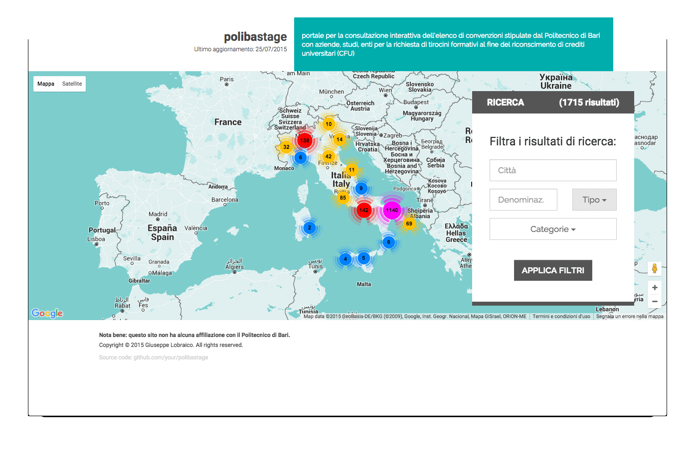

#pstage

Map-based web app to browse through the list of companies in partnership with the [Polythecnic University of Bari](http://poliba.it) for the request of internships and the recognition of university credits (CFU).

#demo

#description
pstage is shipped with a custom standalone ruby script that is able to parse the official binary excel (XLS) file provided by the Polythecnic University of Bari [at this page](http://www.poliba.it/it/didattica/tirocini-studenti) (probably 10yrs old), fix it, (where possible...), and put all the data in a database.

**Partners' office addresses must be then geocoded through a rake script to be correctly placed on the map.
**
Once the offices are placed on the map, the results can be navigated directly on the map, or using custom parameters from a search box (by city, company type, company name).

Every time an office is clicked, the URL is updated with the correct parameters to share or save it for later access.

pstage also has beta administrative capabilites (that is, it could be used as management software instead of the original excel - are you interested?).

Note: the UI of the site has been rigourously designed in Adobe Illustrator before being implemented.

#installation

1. `rake db:setup ; rake db:migrate ; rake db:seed`
(please wait for `db:seed`, it might take a few minutes since it generates 3 tables based on Istat data on cities and so on)

2. locate `scripts/excel_to_db.rb` and set `SRC_XLS` to the path of the current XLS file, then `ruby excel_to_db.rb`.

3. `rake geocode:all CLASS=Office SLEEP=0.25` (plase note: you will get query limited if you use gmaps geocoder without a valid API key)

4. `rails s` and open `http://localhost:3000/map`.
5. partnerships can be edited by accessing `http://localhost:3000/partnerships` (stub code)

#future
This app is production-ready, but it requires minor fixes to make it auto-updating. The administrative part is a stub written to test an implementation of react.js, it requires a visual restyle and other fixes in the related view and controller to perform safe editing operations on the db.

#technologies
* ruby 2.2.2
* rails 4+
* postgresql
* gmaps
* react.js
* jquery
* ...

#why ror?
Because it makes me happy.

#license: MIT

Copyright (C) 2015 Giuseppe Lobraico

Permission is hereby granted, free of charge, to any person obtaining a copy of this software and associated documentation files (the "Software"), to deal in the Software without restriction, including without limitation the rights to use, copy, modify, merge, publish, distribute, sublicense, and/or sell copies of the Software, and to permit persons to whom the Software is furnished to do so, subject to the following conditions:

The above copyright notice and this permission notice shall be included in all copies or substantial portions of the Software.

THE SOFTWARE IS PROVIDED "AS IS", WITHOUT WARRANTY OF ANY KIND, EXPRESS OR IMPLIED, INCLUDING BUT NOT LIMITED TO THE WARRANTIES OF MERCHANTABILITY, FITNESS FOR A PARTICULAR PURPOSE AND NONINFRINGEMENT. IN NO EVENT SHALL THE AUTHORS OR COPYRIGHT HOLDERS BE LIABLE FOR ANY CLAIM, DAMAGES OR OTHER LIABILITY, WHETHER IN AN ACTION OF CONTRACT, TORT OR OTHERWISE, ARISING FROM, OUT OF OR IN CONNECTION WITH THE SOFTWARE OR THE USE OR OTHER DEALINGS IN THE SOFTWARE.
